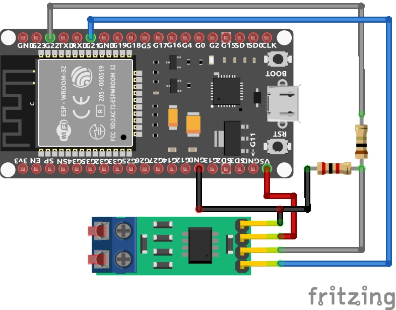

# TWAI Sender

A minimal CAN bus node built on the ESP32's native TWAI (Two-Wire Automotive Interface) controller, using the ESP-IDF event-driven driver (`esp_twai.h` / `esp_twai_onchip.h`).

This project transmits two periodic CAN messages, monitors bus health, and automatically recovers from bus-off conditions.

## What it does

- Transmits a data message (`0x100`, 8 bytes) every 2 seconds
- Transmits a heartbeat message (`0x101`, 1 byte) every 5 seconds
- Runs in self-test mode (`enable_self_test`), so it can be validated without a second physical CAN node
- Monitors bus state transitions (`ACTIVE` → `WARNING` → `PASSIVE` → `BUS_OFF`) via the `on_state_change` callback
- Automatically triggers bus recovery when a `BUS_OFF` condition is detected

## Hardware

| Component | Notes |
|---|---|
| ESP32-D0WDQ6 (rev v1.0) | 38-pin dev board |
| TJA1050 CAN transceiver | 5V logic. Requires a voltage divider on RXD (see wiring below) |
| 1 kΩ + 2 kΩ resistors | Voltage divider, steps RXD down from 5V to ~3.3V |
| Jumper wires | — |

### Wiring

| ESP32 | TJA1050 |
|---|---|
| GPIO21 (TX) | TXD |
| GPIO22 (RX) | RXD (through the 1k/2k voltage divider) |
| GND | GND |
| 5V external supply | VCC |

> Do not power the TJA1050 from the ESP32's `VN` pin — it's an ADC input, not a power source.

See the image below for a visual representation of the wiring.

<p align="center">
  
</p>

## Configuration

Pin assignment and bitrate are defined at the top of `main/main.c`:

```c
#define TWAI_SENDER_TX_GPIO     21
#define TWAI_SENDER_RX_GPIO     22
#define TWAI_BITRATE            1000000 // 1 Mbps
```

## Build and flash

```bash
idf.py set-target esp32
idf.py build
idf.py flash monitor
```

## Validating with a logic analyzer

Probe GPIO21 (TX, before the transceiver) or CAN_L on the TJA1050 output, avoid CAN_H, as most logic analyzers can't reliably decode it due to its voltage threshold. Configure a CAN protocol analyzer (e.g. Saleae Logic 2) at 1 Mbps on the probed channel.

## Testing bus-off recovery

To force the node into a `BUS_OFF` state and observe automatic recovery, briefly short CAN_H to CAN_L (the TJA1050 tolerates bus faults from -27V to +40V per its datasheet). Watch the serial monitor for the `ACTIVE → WARNING → PASSIVE → BUS_OFF → ACTIVE` sequence.
